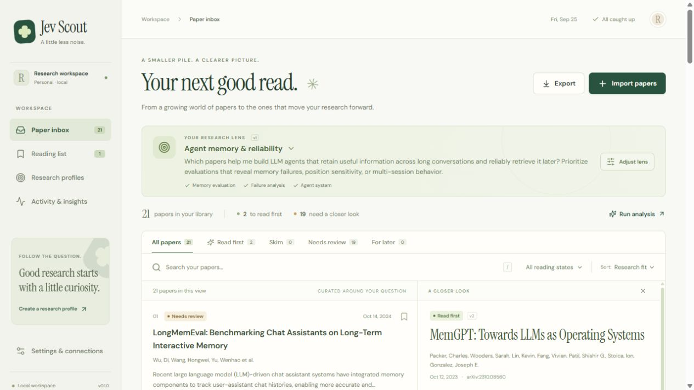
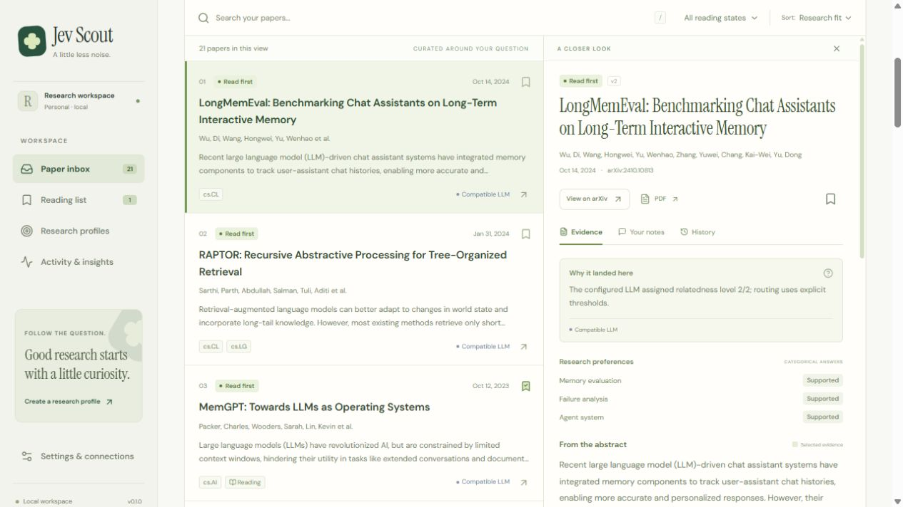

# Jev Scout

**A little less noise. Your next good read.**

An evidence-linked research inbox that sorts arXiv papers around a question you actually care about. Inspect the original abstract behind a recommendation, keep your own notes, and carry your reading list into Zotero or LaTeX.

Built with **React · TypeScript · FastAPI · SQLite**, with **Jev structured decisions**, an optional **local Qwen** comparison, and an offline keyword baseline.

[中文使用说明](docs/USER_GUIDE.zh-CN.md) · [Installation](docs/INSTALLATION.md) · [Architecture](docs/ARCHITECTURE.md) · [Evaluation](docs/EVALUATION.md) · [Demo walkthrough](docs/DEMO.md)

**Start with the demo:** follow the Agent memory & reliability question, inspect MemGPT's original abstract, save a note, then export the reading list. The bundled 20-paper workspace works without a model key. [Five-minute walkthrough](docs/DEMO.md).

**Measured:** constrained local Qwen decoding produced **60/60 schema-valid decisions**, compared with **51/60** in the earlier prompt-only diagnostic run. A separate Jev run validated **59/60** decisions. These measure output reliability and execution; recommendation quality remains unmeasured without human relevance labels. [Results and retained failures](docs/RESULTS.md).

**Exploratory ranking check:** a separate [frozen AI-reference review](artifacts/evaluation/phase-c/reference-review.md) now scores all 60 paper–profile pairs. On the two profiles completed by every method, all five methods reach nDCG@5 = 1.000; this small collection does not demonstrate a model ranking advantage. The failed Jev profile remains excluded and visible. These are assistant judgements, not human relevance labels or user research.

**The tradeoff:** source-linked evidence, explicit provider identity and visible unknowns make decisions inspectable. The application never treats a valid response or a provider confidence score as proof that a paper is relevant.



## The workflow

1. **Follow a question.** Create a research profile with up to three weighted preferences, exclusions, and baseline keywords.
2. **Bring papers in.** Search arXiv or paste official links/IDs. Imports deduplicate papers and retain version history.
3. **Triage with evidence.** Read first, skim, review, or leave for later. Every model-selected quote refers to an unchanged sentence in the abstract.
4. **Make the decision yours.** Save papers, record notes, track reading, and give feedback for each research profile.
5. **Take it with you.** Export BibTeX references, a Markdown reading list, or structured JSON.

Profile edits create a new version and mark older analysis for review. Background jobs expose progress, cancellation, retry, and restart recovery. The activity view separates actual provider usage from offline matching; feedback is stored, not presented as an automatically trained preference model.



## Run it locally

Requires Python 3.12, Node.js 24, and pnpm 11.19.0. The first install needs internet access. No GPU, account, or model key is required for the starter workspace.

```powershell
# Windows PowerShell, from the repository root
.\scripts\bootstrap.ps1 -Dev
.\scripts\start_local.ps1
```

Open **[http://127.0.0.1:8765](http://127.0.0.1:8765)**. A new workspace starts with 20 attributed real papers, three editable research profiles, and clearly labeled keyword analysis. To stop the background process:

```powershell
.\scripts\stop_local.ps1
```

The [installation guide](docs/INSTALLATION.md) includes manual Windows/Linux commands, dependency locks, troubleshooting, and the optional Linux container. The complete application uses a source checkout plus the built frontend; the Python wheel alone is a core/benchmark package.

## Choose an analysis method

| Method | What it does | What you need |
| --- | --- | --- |
| Keyword baseline | Exact keyword/phrase coverage; preferences remain unknown | Nothing; works offline |
| Jev | Typed relatedness, evidence choice, exclusion, and preference decisions | An OpenRouter or TypeSafe key |
| Local / compatible LLM | Strictly validated structured decisions from a generative model | A compatible endpoint, or local CUDA model weights |

The app never silently substitutes one method for another. Jev confidence is a provider signal, **not a calibrated probability of correctness**. The baseline and LLM modes do not manufacture numerical confidence. A selected abstract sentence is model-selected support that the reader must assess, not verification of a paper's experimental claims.

### Jev through OpenRouter

Copy `.env.example` to `.env` if that file does not already exist. Add your key **only to the local `.env` file**:

```dotenv
OPENROUTER_API_KEY=your_key_here
JEV_SCOUT_MODEL=typesafe/jev-1.13
JEV_SCOUT_PRICE_PER_MILLION_INPUT=0.042
```

Restart the app, then choose **Jev semantic decisions** under **Run analysis**. OpenRouter uses the dedicated `https://openrouter.ai/api/alpha/decisions` endpoint. This is the actual Jev adapter, not a chat-model imitation. Leave `TYPESAFE_API_KEY` empty for this setup. Direct TypeSafe access is also supported; use `TYPESAFE_API_KEY` with a native model name such as `JEV_SCOUT_MODEL=jev-latest`. If both keys are set, TypeSafe takes precedence, so its native model name must also be configured.

On Windows, `start_local.ps1` also refreshes `OPENROUTER_API_KEY` from the user environment when the terminal has no value yet. This handles a desktop terminal opened before the variable was configured, without copying the key into a project file. A provider marked **Configured** has configuration available; a real analysis run verifies access.

The input price above was listed on [OpenRouter's Jev page](https://openrouter.ai/typesafe/jev-1.13) on September 25, 2026; verify current pricing before use. Dashboard costs are estimates for successful decisions, not an invoice. Provider fees, failed requests, and any LLM output charges are excluded.

### Existing local Qwen weights

The optional bridge loads a local Hugging Face Qwen model on a CUDA GPU without downloading weights or executing model repository code. Supply a Python environment with compatible CUDA PyTorch and Transformers:

```powershell
.\scripts\start_local.ps1 -WithLocalModel `
  -ModelPath 'D:\models\Qwen3-4B-Instruct-2507' `
  -ModelPython 'D:\path\to\ml-environment\Scripts\python.exe'
```

These are example machine paths. Point them to your own existing installation. If the application is already running, stop it first to apply the model settings. The bridge serves only on localhost, one inference at a time. It constrains generation to the small set of schema-valid decision objects using a tokenizer prefix trie, followed by independent response validation. This is a bounded enum-schema decoder, not a general JSON Schema server. Local API cost is zero, excluding hardware and electricity.

For another compatible server, set `JEV_SCOUT_LLM_BASE_URL`, `JEV_SCOUT_LLM_MODEL`, and, when required, `JEV_SCOUT_LLM_API_KEY`. Local HTTP endpoints and remote HTTPS endpoints are supported. See [.env.example](.env.example).

## Engineering and evaluation

- Original abstract spans, immutable profile/paper revisions, and decision provenance make recommendations inspectable.
- Persisted jobs and revision-aware caching prevent old results from being treated as current analysis.
- Real arXiv ingestion has bounded parsing, source verification, rate limiting, and explicit upstream errors.
- A 60-pair evaluation protocol compares keyword coverage, TF-IDF, BM25, and optional live model runs.
- Human labels are intentionally absent from the bundled template. Ranking quality, calibration, and time-saving claims remain **unmeasured** until independently annotated data is provided.

See [verified results and remaining limits](docs/RESULTS.md), the [intelligence policy](docs/INTELLIGENCE.md), and the [interview guide](docs/INTERVIEW.md). Included runtime measurements are hardware- and workload-specific; they are not a quality leaderboard.

```powershell
# Backend checks, frontend checks/build, and an isolated installed-wheel smoke test
.\.venv\Scripts\python.exe scripts\verify.py --require-frontend --package

# Offline comparison; use a separate output to retain any live report
.\.venv\Scripts\python.exe -m jev_scout.evaluation --output artifacts/evaluation/offline.json
```

[GitHub Actions](https://github.com/RiverHe2000/jev-scout/actions/workflows/ci.yml) runs Windows/Linux verification and a Linux container health/frontend smoke test. The [successful run for `3a68d86`](https://github.com/RiverHe2000/jev-scout/actions/runs/36111106532) verifies those installation paths with offline checks; it does not run paid providers or local GPU models. The Actions page retains results for later revisions.

## Scope and data

This is a **single-user local application**. The web server accepts loopback hosts, checks mutation origins, and keeps credentials server-side. It does not include public hosting, shared accounts, automatic daily subscriptions, PDF full-text analysis, or automatic preference training.

Workspace data lives in ignored `runtime/`; `.env`, model weights, dependencies, and generated builds are excluded from Git. Use `jev-scout backup PATH` for a consistent SQLite backup. The source code is MIT licensed. Bundled paper metadata and abstracts retain their documented provenance; see [data sources](data/SOURCES.md), [data notes](data/README.md), and [font/library notices](frontend/THIRD_PARTY_NOTICES.md).
