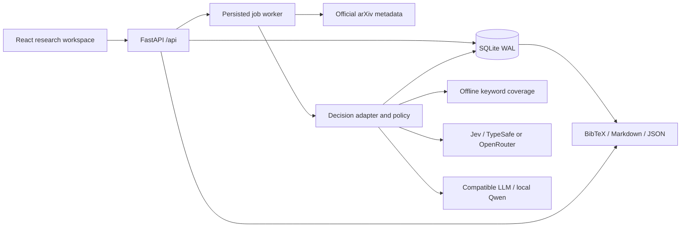

# Architecture

Jev Scout is a local research workspace with one server process and one job worker. The browser owns presentation; the backend owns state, provider credentials, validation, and decision policy.

## A decision is tied to an input revision

A paper has a stable internal ID and a history of metadata snapshots. A research profile has an immutable version history. A persisted decision records both inputs, the adapter and model, the question version, source sentence offsets, usage, and a bounded provider trace. Editing a question does not rewrite the rationale for an old result.

The inbox checks whether the selected decision still matches the current paper and profile. An outdated analysis is shown as needing review. Reading notes and feedback belong to the profile–paper pair, independent of an individual inference call.

The cache uses input revisions and inference configuration. Jev aliases containing `latest` or `preview` bypass cross-job cache reuse. Other configured model names are assumed stable; after changing local weights or replacing a compatible model behind the same name, request a forced rerun. Selecting a cached result changes the visible analysis without claiming another paid inference. Job-linked decisions let a resumed job retain successfully completed work.

## Background work

Import and evaluation requests create persisted jobs. The single worker serializes tasks, exposes progress, and records successes and failures. Retry continues the incomplete work; cancellation is checked before saving a new result. An already-sent remote request may still incur provider usage even if its result is not committed. Recovery after restart preserves job history.

arXiv requests use fixed official endpoints and an in-process request-start limiter. Returned identifiers and versions are validated. ID imports can use the corresponding official abstract page when the API is unavailable; query searches report upstream failure explicitly. No fabricated papers replace a failed import.

## Decision policy and trust

Adapters return a common validated decision shape. The deterministic policy combines relatedness and weighted preferences, applies exclusions and review gates, and preserves unknowns. Evidence is a choice over original sentences, including a no-evidence option. The UI highlights stored offsets instead of rendering a model-generated quotation.

Jev, the keyword baseline, and a compatible LLM are explicit modes. There is no silent fallback. A malformed model answer fails the item. Confidence is unavailable for the baseline and LLM; Jev confidence is not domain calibrated. The full rules and limitations live in [INTELLIGENCE.md](INTELLIGENCE.md).

## Local boundary

The application is deliberately loopback-only and has no multi-user authentication model. Host and request-origin checks protect the local surface. Keys are read from server environment configuration and never returned by the settings API. Dynamic exports use safe names and escaped content. Paper content is treated as data and cannot select an endpoint or filesystem path.

The optional Qwen bridge also binds only to localhost and loads existing weights with remote code disabled. It is a small single-user inference service. Internet access is needed for arXiv imports and remote providers, not for the seeded keyword workspace. A secure multi-user deployment would require a separate design, not merely a changed bind address.

## Module map

| Path | Responsibility |
| --- | --- |
| `frontend/src/` | Workspace screens, accessible controls, API state and tests |
| `src/jev_scout/api.py` | Same-origin API, validation, static application delivery |
| `src/jev_scout/store.py` | SQLite persistence, revisions, cache selection and exports' data |
| `src/jev_scout/jobs.py` | Import/evaluation worker lifecycle |
| `src/jev_scout/engine.py` | Provider contracts, evidence and deterministic routing |
| `src/jev_scout/arxiv.py` | Verified metadata ingestion |
| `src/jev_scout/evaluation.py` | Baselines, metrics, label protocol and live runs |
| `src/jev_scout/local_model.py` | Optional local CUDA inference bridge |
| `data/` | Attributed public fixtures and unfilled human-label template |
| `scripts/` | Reproducible installation, process lifecycle and verification |

The source checkout is the full application distribution. The installed wheel includes core code and evaluation fixtures; the UI build is not bundled in that wheel.
