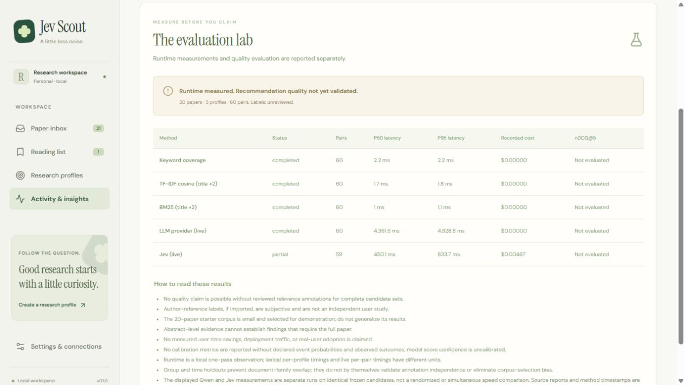

# Verification record

Development verification was performed on Windows, Python 3.12, Node.js 24, and pnpm 11.19.0 on September 25, 2026. This file records observations, not projected user impact.

## Application and packaging

The local verification checks completed successfully: **204 backend tests, 16 frontend tests, Python linting, TypeScript checking, production frontend build, dependency consistency, and the isolated installed-wheel smoke test**. The backend was rerun after the live Jev rounding-compatibility fix; the frontend checks distinguish categorical LLM preferences from numerical confidence and separate relatedness confidence from evidence uncertainty. The backend emitted one dependency deprecation warning for Starlette's httpx-based test client; no test failed. These counts are repository checks, not model quality measurements.

The complete application was run from its source checkout with a built React frontend. An independent fresh runtime-only virtual environment also installed the locked dependencies and source package, then served the API and built UI. An isolated wheel installation outside the source directory loaded all 20 public papers, three research profiles, and ran the 60-pair offline benchmark without using source-tree imports.

Browser checks exercised saving a paper, writing a note, changing reading status, recording feedback, refreshing to verify persistence, Markdown export, real arXiv ID import, creating and editing a research profile, and reversible archiving. The test-created profile is named `Workflow verification` and is archived. The local example note is explicitly identified as a demo note. These are development checks, not evidence of adoption or a user study.

The browser import of arXiv `2303.08774` completed and added the real **GPT-4 Technical Report**, with its source version and metadata provenance. The seeded 20-paper fixture remains unchanged. Desktop and 390-pixel mobile layouts were visually inspected; mobile inbox/detail navigation was exercised and had no horizontal page overflow.

After the isolated benchmark, a separate **21-paper local Qwen analysis was started through the actual browser UI** for the Agent memory & reliability profile. It completed with **21 evaluated, zero reused, and zero failed**. Those full decisions, evidence, usage, and job history are saved in the local workspace database. This is an end-to-end application check distinct from the 60-pair benchmark file.

## Model evidence

The local model is **Qwen3-4B-Instruct-2507**, loaded from existing weights on an **NVIDIA RTX 4070 12 GB** using CUDA PyTorch and Transformers. Actual model calls use the same validated decision adapter as the application.

An initial prompt-only run returned valid decisions for 51 of 60 paper–profile pairs. Nine responses failed strict validation, including quoted `"true"` where a JSON boolean was required. Those failures were not coerced or scored as valid. The bridge was changed to bounded finite-enum constrained decoding. The complete rerun produced **60 of 60 schema-valid decisions with zero errors**; the parser remains strict. Both the [initial report](../artifacts/evaluation/qwen-prompt-only.json) and [final Qwen report](../artifacts/evaluation/qwen-report.json) are retained.

| Final local Qwen measurement | Observed value |
| --- | --- |
| Candidate pairs | 20 papers × 3 profiles = 60 |
| Validated decisions / errors | 60 / 0 |
| Per-pair latency P50 | 4.362 seconds |
| Per-pair latency P95 | 4.929 seconds |
| Whole live-method elapsed time | 261.989 seconds |
| Reported input / output tokens | 54,299 / 2,324 |
| Configured input API charge | $0, excluding hardware/electricity |
| Routes | 24 read, 18 skim, 18 later |
| Recommendation quality | Not evaluated; no human labels |

The valid-output improvement is a format-reliability observation on this fixed collection, not an accuracy improvement. The finite-enum decoder limits the local schema and output space; it does not establish whether the chosen labels are correct.

The committed [evaluation report](../artifacts/evaluation/report.json) is the source of runtime measurements and completion status. Its method-level latency units differ: lexical baselines time a full profile–corpus ranking; a model call times one paper–profile pair. These numbers must not be compared as if the work units were identical. Model-loading time is outside a warmed-up inference measurement.

## Actual Jev integration

Live Jev access through OpenRouter was verified on September 25, 2026 using an existing Windows user environment credential. The returned model was `typesafe/jev-1.13-20260917`. The first MemGPT request took **745.6 ms**, used **1,686 input tokens**, and had an estimated input charge of **$0.000070812** at the configured $0.042 per million input tokens. It selected abstract sentence `s4` and routed the paper to `read`.

The initial batch exposed an integration edge case: scores and distributions reported to two decimal places could fail the original fixed consistency tolerance. The initial 60-pair report had 48 validated decisions and 12 rejected responses; the separate workspace job had 20 validated decisions and one rejection. The [original benchmark](../artifacts/evaluation/jev-initial-validation.json) is retained. Reported probabilities and scores are preserved rather than normalized or rewritten. Validation compatibility and subsequent measurements are recorded in the intelligence policy and live report.

After the [rounding compatibility fix](INTELLIGENCE.md), the [Jev rerun](../artifacts/evaluation/jev-report.json) recorded:

| Jev measurement | Observed value |
| --- | --- |
| Attempted / validated decisions | 60 / 59 |
| Unresolved single-run failures | 1 |
| Successful-request latency P50 / P95 | 450.088 / 833.730 ms |
| Whole live-method elapsed time | 29.015 seconds |
| Successful input / output tokens | 111,229 / 9,832 |
| Estimated successful input charge | $0.004671618 |
| Decisions using rounding compatibility | 10: eight score checks, two evidence distributions |
| Recommendation quality | Not evaluated; no human labels |

The remaining FlashAttention/agent-memory failure did not reproduce in one isolated recheck. Its original exact cause was not retained by the benchmark's generic error record, so it remains an unresolved anomaly. The original single-pass result is **59/60**, not retroactively converted to 60/60. Failed and diagnostic calls may incur charges outside the successful-decision cost totals.

The actual workspace retry completed **all 21 papers**, reusing 20 successful results and issuing one new call. The 21 stored Jev decisions report **39,391 input tokens**, **3,499 output tokens**, **528.47 ms median latency**, and **$0.001654422 estimated input charge**. Under the current uncalibrated thresholds, two papers route to read and 19 to review. Successful parsing does not imply a confident recommendation or correct relevance judgement.

The displayed report combines the original Qwen/baseline measurements with the separate Jev run only after checking that the frozen dataset and protocol match. Each method retains its source report and timestamp. These independent runs are not a randomized or simultaneous speed comparison. The original reports remain available alongside the combined display file.

## What remains unmeasured

- Human relevance labels, recommendation accuracy, ranking improvements, calibration, and reading-time savings.
- User adoption and multi-user operation.
- Provider billing reconciliation, including charges for rejected or failed requests.
- Linux execution and Docker image execution on the development machine. Docker's engine was unavailable; a CI definition alone is not a passed run.

The evaluation template deliberately leaves labels empty. Quality metrics stay unavailable until a valid annotated dataset is supplied. Successful schema validation establishes the shape of a response, not its semantic correctness.

## Reproduce

Run the repository verification script described in [INSTALLATION.md](INSTALLATION.md). To rerun a live comparison, configure the selected provider server-side and follow [EVALUATION.md](EVALUATION.md). Preserve separate reports when comparing implementations; do not overwrite failures merely to make a result look better.
